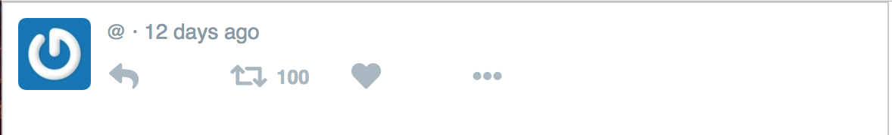

## Setup

The react-tweet folder contains the components that needs to be filled out, whereas the solved folder has a working rendition of the tweet.

To run, clone this repo in your local machine, then cd into one of the folders and run an NPM install, and then an NPM start.
```
git clone https://github.com/blatde91/react-practice-modules.git
cd react-practice-modules/react-tweet
npm install
npm start
```

To view the solved tweet change your directory back to workspace and follow these commands.

```
cd react-practice-modules/react-tweet-solved
npm install
npm start
```
---

The tweet in the react-tweet folder should show this:




## Exercise
This react-tweet is broken, your job is to debug the code in the src folder to show a proper tweet!

 - Debug the components so that the twitter name, handle, message, and number of likes render correctly
 - Change the dummy data with your own twitter name and handle

---
## Useful Commands
```
cd - changes directory
ls - lists files from current folder
```
